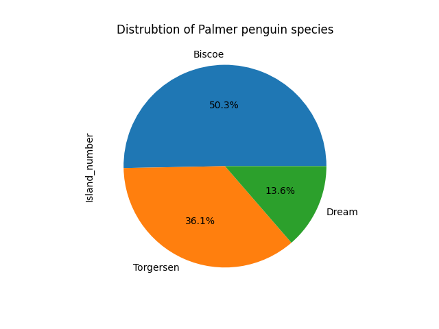
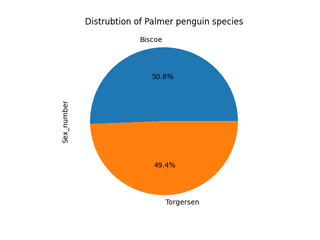
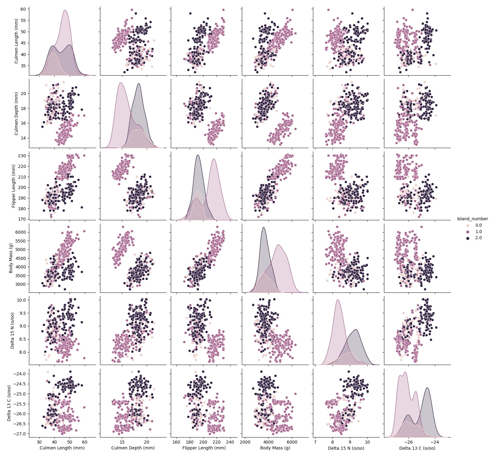
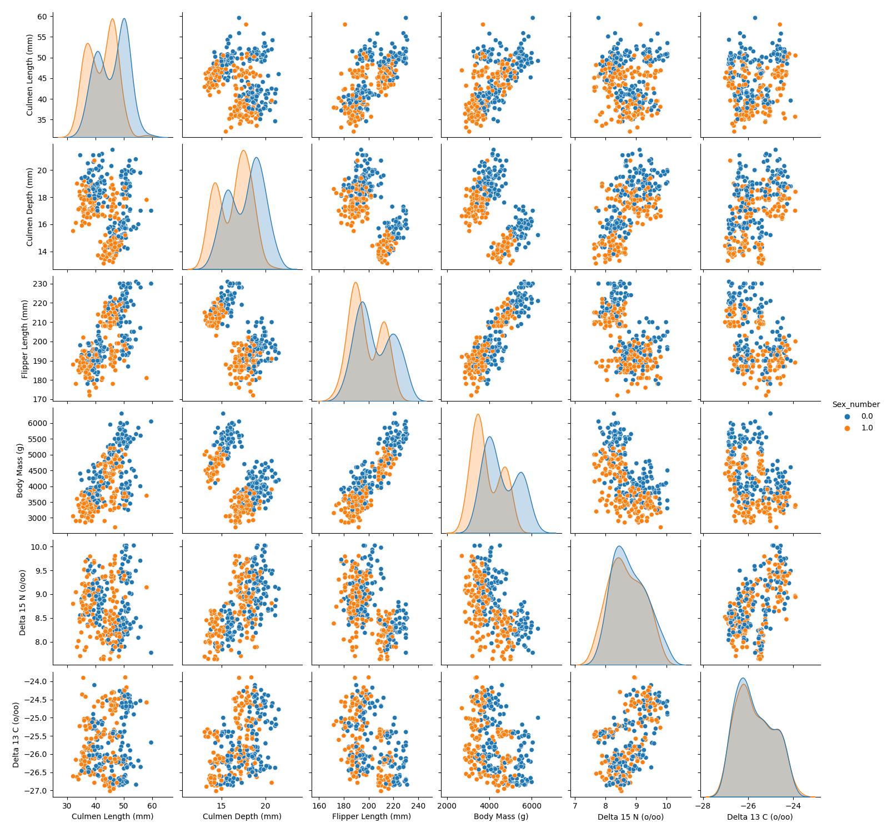

## My Project

I applied machine learning techniques to investigate... Below is my report.

***

## Introduction

In this study we will use the Palmer penguin dataset from the UCI Machine Learning Repository to evaluate and compare logistic regression model with Multi-Layer Perceptron (MLP) Classifier Neural Network. The purpose of this study is to compare the performance of the two models for binary classification as well as multi-classification. To do this we will examine three sets of outcomes: penguin species, geographical location of the penguins, and penguin sex. The first two outcomes can be classified into three classes, whereas the last into two.

We concluded that overall the MLP Classifier NN performs better than the classical logitsic regression model, however, both show the best results for the "species" class. 

## Data

The data for this study was collected from penguins nesting on three islands within the Palmer Archipelago (Biscoe, Torgersen and Dream), near Anvers Island, Antarctica. The data was collected during three austral summers between 2007-2010, during the penguins nesting time. This field work collected data from three penguin species: the Adelie, Chinstrap and Gentoo.  

*Figure 1: Distrubtion of the three different penguin species exmained in this data: Adelie, Gentoo, and Chinstrap.*

*Figure 2: Distrubtion of the three different islands where penguin data was collected from: Biscoe, Torgersen, and Dream.*

*Figure 3: Distrubtion of the two penguin sexes exmained in this data: male and female.*

Overall 344 samples were taken, and data was collected of nine different features: species, region, island, individual IDs, nesting stage, clutch completion, egg date, culmen length, culmen depth, flipper length, body mass, sex, and carbon and nitrogen isotopes from blood samples. For this project we are not interested in the nesting properties, but rather the physical and chemical penguin properties. Thus, we've disposed data of the individual IDs, nesting stage, clutch completion and egg date. Additionally, samples with missing data were disposed of, decreasing the dataset to a sample size of 330. The categorical values, such as the sex, island and species names, were converted to numerical integers (male = 0, female = 1; Biscoe = 0, Torgersen = 1, Dream = 2; Adelie = 0, Gentoo = 1, Chinstrap = 2). 
Figs. 1,2 and 3 show pie charts of the distribution based on the penguin species, geographic region (islands) and sex. Pairwise relationship are also plotted, showing the relationship between the features for each categorical group of species, islands and sex in Figs. 4,5 and 6, respectively.
We note a more defined grouping in the case of species (Fig. 4), especially with physical attributes such as the culmen length and depth, as well as the chemical attribute for carbon isotopes. On the other hand, this clear grouping can't be seen for the islands feature, although penguins originating from Torgersen seem to have unique features in some of the cases (Fig. 5). Lastly, the sex feature also doesn't visually appear to be organized into distinguishable groups, although there seems to be a more organized grouping for the culmen length and depth (Fig. 6). These figures give us a sense of how well the model will perform based on the chosen output. Given these figures, visual conclusions would imply that a supervised model with an output category like species would yield better results.

*Figure 4: Pairwise relationships between features for the three different penguin species: adelie (0), gentoo (1) and chinstrap (2).*

*Figure 5: Pairwise relationships between features for the three different penguin species: Biscoe (0), Torgersen (1) and Dream (2).*

*Figure 6: Pairwise relationships between features for the two penguin sexes: male (0) and female (1).*

## Modelling

To determine the relationships between the independent and dependent variables, we will compare two models: the classic logistic regression model and a Multi-Layer Perceptron (MLP) classifier neural network. 

Logistic regression models are supervised machine learning models that, unlike in linear regression models, are used for categorical data that deals with integer values. The species, sex and island data can be represented as integer values 0,1,2, etc. and therefore as categories . We note that for species and islands, there are three categorical classes, and therefore we used the multinomial fit in the logistic regression model. This is captured in Fig. 2, where we see a 'jump' in the data for these features. Unlike linear regression models that fit a slope to this data, logistic regression models are a classification model and use a tanh like function that can better represent the process of categorization into these groups.

The second model is, firstly, a neural network. Therefore we need a neural network structure. The network is consists of three layers: the input layer, the hidden layer and the output layer. The input layer consists of the independent variables (culmen length, culmen depth, flipper length, body mass, sex, island, carbon isotope and nitrogen isotope). The hidden layer consists of three neurons and the output layer will have three in the cases of species and island, and 2 in the case of sex. These layers were chosen based on the rules of thumb taught in class. Mainly, I chose for the number of hidden neurons to be equal to 2/3 of the input and output neurons. For consistency, I approximated this as 8. 

As part of the neural network, we use the Multi-Layer Percepton (MLP) Classifier. The MLP Classifier is a supervised learning algorithm that trains using gradient descent in the form of a stochastic gradient-based optimizer, where the gradients are calculated using backpropagation.The activation function used in the hidden layer is the rectified linear unit function.

Lastly, the dataset was split into training and testing data.$20\%$ of the data was reserved for checking the accuracy of the trained model, while the data was scaled independently when used as model input. 

## Results

Here we evaluated the models' accuracy for species, islands and sex. Additionally, in order to evaluate the performance of the classification, we used a confusion matrix, which is suited for classification models using supervised learning frameworks. These results will help us understand where the model has gone wrong, and allows for more transparency in case the model is falsely predicting the correct classification.

# Species

We examined the logistic regression model's ability to accurately predict the probability of the three different penguin species -- Adelie, Gentoo and Chinstrap -- based on the independent variables. We found that the accuracy score was 100\%. We've also examined the confusion matrix, plotted in Fig. 7. The results indicate that all penguin species are identified correctly.

*Figure 6: Pairwise relationships between features for the two penguin sexes: male (0) and female (1).*

## Discussion

From Figure X, one can see that... [interpretation of Figure X].

## Conclusion

Here is a brief summary. From this work, the following conclusions can be made:
* first conclusion
* second conclusion

Here is how this work could be developed further in a future project.

## References
[1] DALL-E 3

[back](./)

