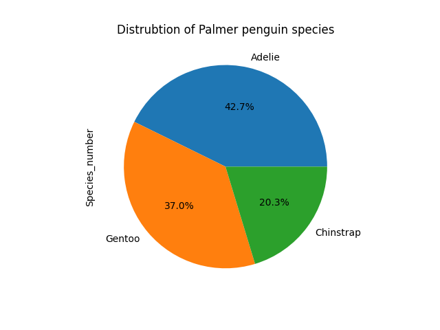
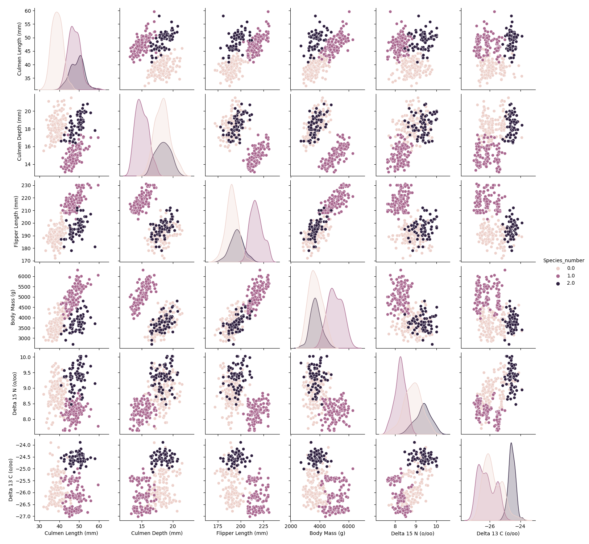

## My Project

I applied machine learning techniques to investigate... Below is my report.

***

## Introduction

In this study we will use the Palmer penguin dataset from the UCI Machine Learning Repository to evaluate and compare logistic regression model with Multi-Layer Perceptron (MLP) Classifier Neural Network. The purpose of this study is to compare the performance of the two models for binary classification as well as multi-classification. To do this we will examine three sets of outcomes: penguin species, geographical location of the penguins, and penguin sex. The first two outcomes can be classified into three classes, whereas the last into two.

We concluded that overall the MLP Classifier NN performs better than the classical logitsic regression model, however, both show the best results for the "species" class. 

## Data

The data for this study was collected from penguins nesting on three islands within the Palmer Archipelago (Biscoe, Torgersen and Dream), near Anvers Island, Antarctica. The data was collected during three austral summers between 2007-2010, during the penguins nesting time. This field work collected data from three penguin species: the Adelie, Chinstrap and Gentoo.  

{: width="50" }

*Figure 1: Distrubtion of the three different penguin species exmained in this data: adelie, chinstrap and gentoo.*

Overall 344 samples were taken, and data was collected of nine different features: species, region, island, individual IDs, nesting stage, clutch completion, egg date, culmen length, culmen depth, flipper length, body mass, sex, and carbon and nitrogen isotopes from blood samples. For this project we are not interested in the nesting properties, but rather the physical and chemical penguin properties. Thus, we've disposed data of the individual IDs, nesting stage, clutch completion and egg date. Additionally, samples with missing data were disposed as well, the dataset decreasing to a sample size of 330. 

The pairwise relationship between the features for each species group is highlighted in Fig.2.

{: width="50" }

*Figure 2: Pairwise relationships between features for the three different penguin species: adelie (0), gentoo (1) and chinstrap (2).*

## Modelling

Here are some more details about the machine learning approach, and why this was deemed appropriate for the dataset. 

The model might involve optimizing some quantity. You can include snippets of code if it is helpful to explain things.

```python
from sklearn.ensemble import ExtraTreesClassifier
from sklearn.datasets import make_classification
X, y = make_classification(n_features=4, random_state=0)
clf = ExtraTreesClassifier(n_estimators=100, random_state=0)
clf.fit(X, y)
clf.predict([[0, 0, 0, 0]])
```

This is how the method was developed.

## Results

Figure X shows... [description of Figure X].

## Discussion

From Figure X, one can see that... [interpretation of Figure X].

## Conclusion

Here is a brief summary. From this work, the following conclusions can be made:
* first conclusion
* second conclusion

Here is how this work could be developed further in a future project.

## References
[1] DALL-E 3

[back](./)

